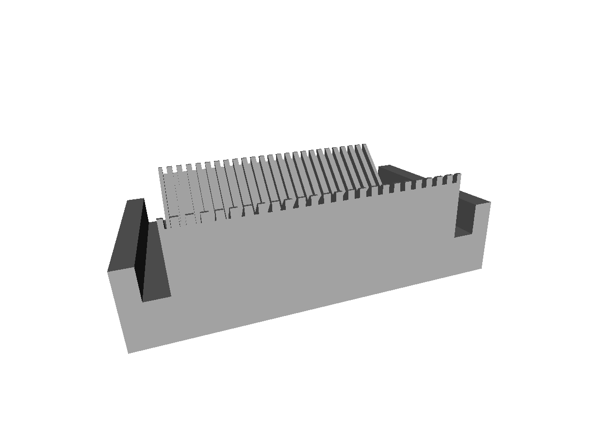

# A Coverslip Holder

This coverslip holder is perfect to manipulate or store 22x22, 18x18 and 22x40mm coverslips. The holders are made with Teflon (also known as PTFE) which has an excellent resistance to a wide range of strong chemicals (acids and solvents) and also a very strong resistance to high temperature.

We use a micro-milling machine to make them.

