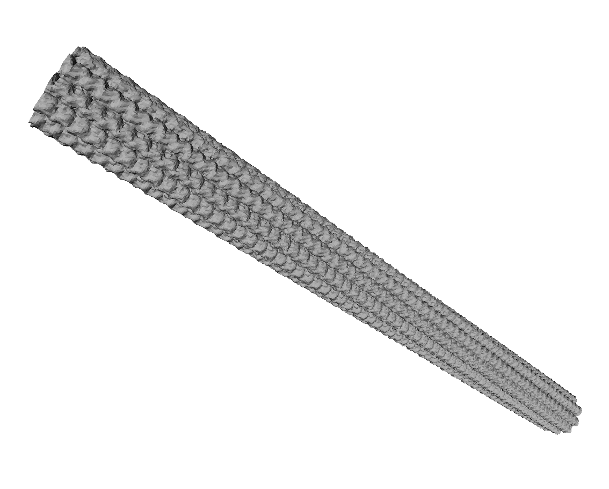

# Long microtubules

11 and 13 PFs microtubule models that allow, once printed, to clearly see the difference in twist.

Those models have been 3D printed with the VeroWhitePlus plastic material.

## 11 protofilaments

## 13 protofilaments

