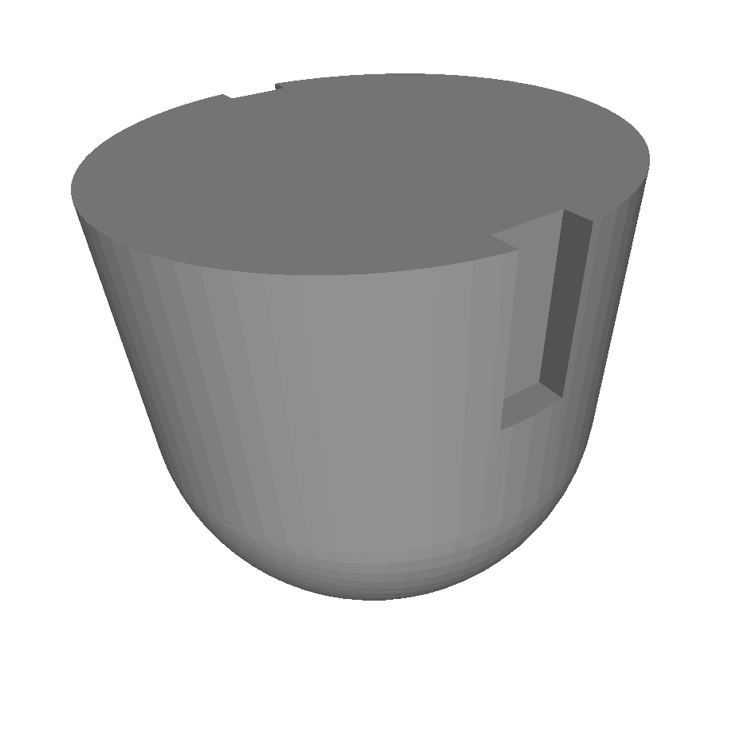

# Spin Support

We used this part to hold a coverslip in a spinning tube. It allows to spin things on a rounded coverlip. The two little holes on the side help taking out the support and the coverlsip from the tube with a tweezer.

This model has been 3D printed with the VeroWhitePlus plastic material.

